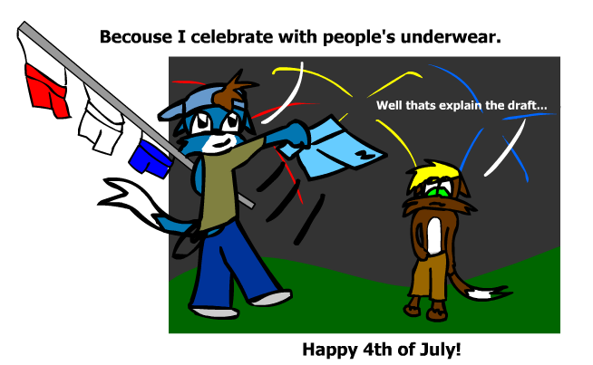
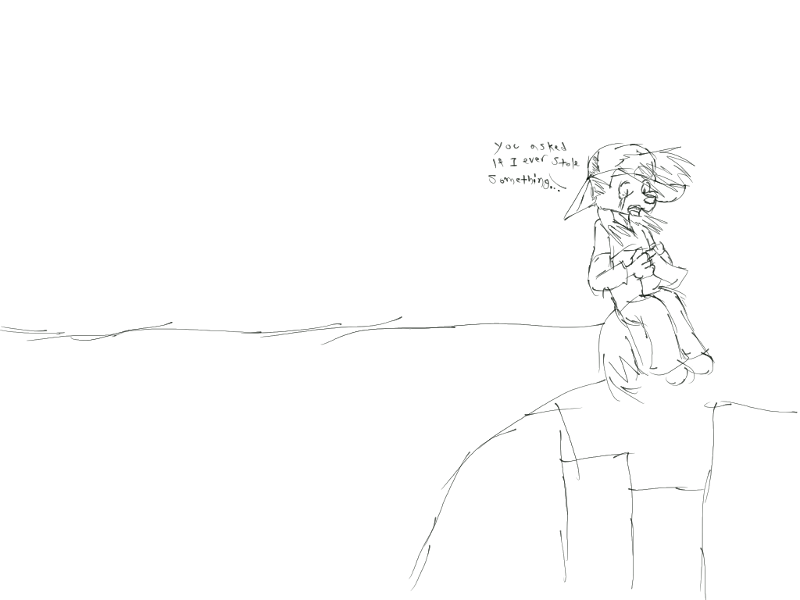

# Cliffhanger arc

The  Cliffhanger arc is a story arc left over from The Furry Blue DJ. It is a literal cliffhanger because it never finished because life got in the way. It builds off of the tensions created when John Grenon, originally used for a punch line, had his underwear stolen by his freind, Zack Casey, as part of Boxers of America. The premise is that Zack never apologized or returned them and this has left John rather bitter.

It was meant as a justication for Tom & Jerry-style comedy between Zack and John during The Furry Blue DJ, since the web comics had not much else to work with. But it serves as a serious story arc that'll test their freindship in What's New, Furry Blue?

The plot starts when John asks, _"Have you ever stole something before?"_